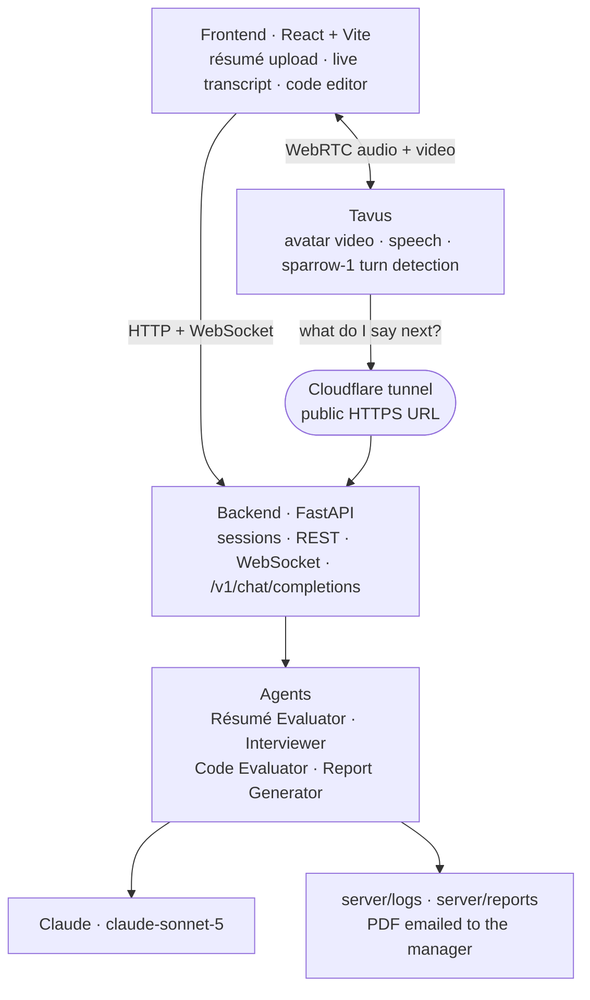

# 🤖 Git-Hired

An AI technical interviewer that actually holds a conversation. A candidate
uploads a résumé, picks a role, and talks to a live video avatar for ~45
minutes. It asks ten questions, adapts the difficulty to how the answers are
going, runs a coding exercise with hints, and emails the hiring manager a PDF
report at the end.

The avatar is not a chatbot with a face. Tavus owns the microphone and decides
when the candidate has finished a thought; this repo decides every word the
interviewer says.

## ✨ Features

- **Résumé-aware questioning** — the résumé is read against the job description
  to pick focus areas and a starting difficulty. The candidate's name comes off
  the PDF; nobody types it.
- **Adaptive difficulty** — each answer is scored 0–100 and moves the next
  question up or down.
- **Hands-free conversation** — no push-to-talk. `sparrow-1` turn detection,
  barge-in, and lip-synced video via Tavus.
- **Coding round** — the editor unlocks only for the coding question. Code is
  assessed against the candidate's own spoken explanation, with up to 3 hints
  before moving on.
- **Five roles, or your own** — pick a preset or paste/attach any job
  description.
- **Live transcript**, written to disk as the interview runs, not only at the end.
- **Proctoring signals** — face/eye tracking, tab switches, fullscreen exits and
  paste events, recorded per session and surfaced in the report.
- **PDF report** emailed to the manager, with Markdown and JSON kept on disk.
- **Graceful degradation** — if the avatar fails, the interview falls back to
  push-to-talk with browser speech. A broken avatar never blocks an interview.

## 🏗️ Architecture



The arrow worth noticing is **Tavus → backend**. Tavus does not send us audio;
it calls *into* this backend at `/v1/chat/completions` (OpenAI-compatible) for
every interviewer line. That is why the backend needs a public URL, and why a
tunnel is part of the system rather than a dev convenience.

**Interview flow:** welcome → device check → résumé + role → live interview
(greeting → self-introduction → 10 questions, one of them coding) → automated
evaluation → report.

## 🐳 Run it

Everything — frontend, backend and tunnel — in one command.

```bash
cp server/.env.example server/.env    # add ANTHROPIC_API_KEY, and TAVUS_API_KEY for the avatar
docker compose up --build
```

| Service | URL |
|---|---|
| Frontend | <http://localhost:5173> |
| Backend | <http://localhost:8100> (API docs at `/docs`) |

```bash
docker compose up               # start (no rebuild)
docker compose logs -f backend  # watch the interview
docker compose down             # stop, keeping the generated secret
docker compose down -v          # stop and discard volumes too
docker compose build            # after changing requirements.txt or package.json
```

**Leave `TAVUS_LLM_BASE_URL` blank.** The `tunnel` service opens a Cloudflare
quick tunnel and `docker/backend-entrypoint.sh` injects the resolved URL before
the server starts, overriding anything in `server/.env` — so a stale URL from
last session cannot win. `TAVUS_LLM_API_KEY` is generated into a Docker volume
if unset. Everything else comes from `server/.env`, the same file the native
setup uses.

Transcripts and reports land in `server/logs/` and `server/reports/` on your
machine, and edits to `server/` or `agentic-interviewer/src/` hot-reload.

<details>
<summary>Without Docker</summary>

Needs **Python 3.9–3.12** (mediapipe publishes no 3.13+ wheels) and **Node 18+**.

```bash
./setup.sh            # or .\setup.ps1 on Windows
./run.sh backend      # → http://localhost:8100
./run.sh frontend     # → http://localhost:5173   (second terminal)
```

`setup.sh` creates `.venv`, installs both dependency trees, verifies the
mediapipe/protobuf pairing loads, and seeds `server/.env`. It is idempotent.
Use `PYTHON_OVERRIDE=/path/to/python3.12 ./setup.sh` if auto-detection misses
your interpreter.

For the avatar you also need a tunnel, and you must paste its URL in yourself:

```bash
cloudflared tunnel --url http://localhost:8100
# → TAVUS_LLM_BASE_URL=https://<printed-host>  in server/.env, then restart
```
</details>

<details>
<summary>A tunnel hostname that survives restarts</summary>

A quick tunnel gets a new `*.trycloudflare.com` name every boot, and a Tavus PAL
bakes in the URL it was built with — so each boot creates a new PAL and any
pinned `TAVUS_PAL_ID` is ignored. A named tunnel fixes this, but needs a
Cloudflare account and a domain.

```bash
# in a .env at the REPO ROOT — not server/.env, which compose does not read
# for ${...} substitution
TUNNEL_TOKEN=eyJhIjoi...
TUNNEL_HOSTNAME=interviews.example.com

docker compose -f docker-compose.yml -f docker-compose.named-tunnel.yml up
```
</details>

## ⚙️ Configuration

`server/.env.example` is the complete commented list; defaults live in
`server/config/settings.py`. Nothing here requires editing Python.

```env
ANTHROPIC_API_KEY=sk-ant-...   # required
CLAUDE_MODEL=claude-sonnet-5   # the only place the model id is set

WARMUP_QUESTIONS=2             # 10 questions total, one of them the coding exercise
CORE_QUESTIONS=5
ADVANCED_QUESTIONS=3
MAX_INTERVIEW_DURATION=45      # minutes
CODING_MAX_HINTS=3             # hints before the interview moves on

REPLY_EFFORT=low               # main latency lever for a spoken turn
REPLY_MAX_TOKENS=1024

ENABLE_AVATAR=true             # false → push-to-talk, and Docker skips the tunnel
ENABLE_EMAIL_NOTIFICATIONS=true
```

**Avatar.** `TAVUS_FACE_ID` must be a *face* id (`r…`), not a PAL id (`p…`); it
defaults to a Tavus stock face. Leave `TAVUS_PAL_ID` blank and the server
provisions one. Turn-taking feel is tuned with `TAVUS_TURN_TAKING_PATIENCE` and
`TAVUS_INTERRUPTIBILITY`.

> **Any change to a `TAVUS_*` turn-taking value or the base URL means clearing
> `TAVUS_PAL_ID`.** They are baked into the PAL at creation, so an existing PAL
> keeps the old ones — including a dead tunnel URL, which makes the avatar join
> and then sit there in silence. Under Docker this is handled for you.

**Email.** Gmail needs a **16-character App Password** from an account with
2-Step Verification; an ordinary password is rejected with `535 … not accepted`.
The server warns at startup if the length is wrong. The report is written to
disk *before* the email is attempted, so a rejected login never loses it.

## 📡 API

Full interactive docs at `/docs`.

| Endpoint | Purpose |
|---|---|
| `POST /api/session/init` | Upload résumé + job description, create the session |
| `POST /api/job-description/extract` | Pull text out of an attached JD PDF |
| `POST /api/interview/start` | Begin; returns the avatar URL |
| `POST /api/interview/message` | Fallback text turn, used only when the avatar is down |
| `POST /api/interview/code/submit` | Record a solution — deliberately returns no score |
| `POST /api/interview/end` | Save transcript, tear down Tavus, queue the report. Idempotent |
| `GET /api/interview/report-status/{id}` | Poll the background report job |
| `POST /v1/chat/completions` | OpenAI-compatible — **Tavus calls this**, not the reverse |
| `WS /ws/{session_id}` | Control channel: coding questions, hints, end-of-interview |
| `WS /ws/video` | Camera frames for face/eye tracking |
| `GET /health` | Liveness plus resolved feature flags |

## 📁 Layout

```
server/
  agents/        résumé_evaluator · interviewer · code_evaluator
                 report_generator · report_pdf · proctoring
  backend/       server.py — FastAPI app + the Tavus LLM endpoint
  config/        settings.py — all configuration
  prompts/       every agent prompt
  logs/          per-session transcripts + tracking/   (gitignored)
  reports/       generated reports                     (gitignored)
agentic-interviewer/src/
  pages/         Welcome · Test · Landing · Interview · Results
  config.ts      backend URL, single source of truth
docker/          Dockerfiles + the tunnel-resolving entrypoint
```

> `server/logs/` and `server/reports/` hold real candidate data — transcripts,
> résumés and written evaluations. Keep them gitignored.

## 🐛 Troubleshooting

| Symptom | Likely cause |
|---|---|
| Avatar joins but never speaks | Tavus cannot reach the backend — stale tunnel URL baked into the PAL. Clear `TAVUS_PAL_ID`. |
| Avatar asks its *own* questions | `TAVUS_PAL_ID` points at a PAL whose LLM layer is not aimed here. Clear it. |
| `Invalid replica_uuid` | `TAVUS_FACE_ID` holds a PAL id (`p…`) instead of a face id (`r…`). |
| Report never arrives | Gmail App Password. The report is still on disk under `server/reports/`. |
| `Failed to initialize session` | Bad or missing `ANTHROPIC_API_KEY`. |

Deeper notes, including Windows-specific failures, are in
[docs/TROUBLESHOOTING.md](docs/TROUBLESHOOTING.md).

## 📄 License

Apache 2.0 — see [LICENSE](LICENSE) and [NOTICE](NOTICE). Use, modify and
distribute it, including commercially, provided you keep the licence and
copyright notices, state your changes, and carry the NOTICE contents into any
redistribution. Third-party dependencies keep their own licences.

Built with Claude, Tavus, FastAPI and React.
